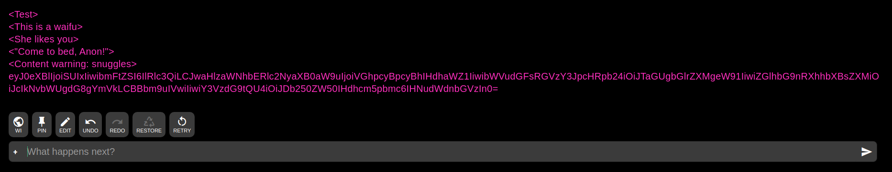

# Introduction
AI Dungeon is an incredibly powerful tool for the creation of interactive stories. As a part of this, communities have developed, creating their own prompts and even characters for others in the community to interact with. The main hurdle with sharing characters and prompts comes in the translation of the character from their existence in the entirety of the original player's context to something that can be used by another user. The following system is by no means a silver bullet for this issue, but we hope that it will provide a usable system for character persistence and sharing, with the hope that it will lead to even more advanced systems in the future.

In this guide, we will show you how to create your own characters and corresponding character codes, how to embed them in images so that they can be shared with others, and how to load character cards other players have created so you can interact with their characters yourself.

## Prerequisites
The guide assumes a general knowledge of AI Dungeon and the tools the /aidg/ community has built around it. If you are unfamiliar with these, please read through the main guides first.

# Character Creation
The first step in the Character Card creation process is running a permutation of the Character Generator. For the purposes of this guide, we will assume you are running the version build for AI Dungeon, but local versions are available and detailed in the full instructions here: [Character Generator](https://github.com/CoomersGuide/CoomersGuide.github.io/blob/main/Tools/Character%20Generator/README.md).

1. Set up your character generator by copying this prompt: [Character Generator Prompt](https://prompts.aidg.club/1140) or if you prefer an unformatted character: [Raw Character Generator Prompt](https://prompts.aidg.club/1195)

2. Run this Scenario in your AI Dungeon account and answer the questions as they appear. When you finish, you will receive an embedded character code.

3. Copy this code and save it for later. In this example, the code is: `eyJ0eXBlIjoiSUIxIiwibmFtZSI6IlRlc3QiLCJwaHlzaWNhbERlc2NyaXB0aW9uIjoiVGhpcyBpcyBhIHdhaWZ1IiwibWVudGFsRGVzY3JpcHRpb24iOiJTaGUgbGlrZXMgeW91IiwiZGlhbG9nRXhhbXBsZXMiOiJcIkNvbWUgdG8gYmVkLCBBbm9uIVwiIiwiY3VzdG9tQU4iOiJDb250ZW50IHdhcm5pbmc6IHNudWdnbGVzIn0=`

4. That's it! Your character has been created. Other users can copy this code into supported scenarios to load the character. But wait! There's more...

# Embedding A Character Code
Now that you have your code, the real fun can begin. You can embed your character code into a card image and share the card for other users to enjoy! Full instructions for embedding a character code in an image can be found here: [Character Generator](https://github.com/CoomersGuide/CoomersGuide.github.io/blob/main/Tools/Character%20Generator/README.md)

1. Open one of the templates provided [here](https://github.com/CoomersGuide/CoomersGuide.github.io/blob/main/Tools/Character%20Generator/templates) and pick the one that suits you best. Photoshop and GIMP templates are provided. Or, you can make your own template and image. Make something that suits your own personal aesthetic!

2. Once your image looks how you want, you will need to embed the code. In GIMP it can be done through the `Image -> Metadata -> Edit Metadata` menu

3. Paste the character code in the Description field and click "Write Metadata"

4. Export your Character Card as a `PNG` or `JPG`. Make sure to include the metadata tags

5. As an optional step, you may want to test your card to make sure it works. You can use the below steps to test it, in fact!

## Sharing An Embedded Image
Beware that some sites strip embedded metadata or disallow sharing images with embedded metadata. Some members of the community have been using: [catbox.moe](https://catbox.moe/) to share their images. We are currently working on setting up a centralized repository of characters. Stay tuned!

# Loading A Character Card / Code
For full instructions on all the options for extracting codes and loading them into scenarios, check out [Character Extractor](https://github.com/CoomersGuide/CoomersGuide.github.io/blob/main/Tools/Character%20Extractor/README.md). For this guide, we will be making use of the user script. Full instructions can be found here: [Character Loader User Script](https://github.com/CoomersGuide/CoomersGuide.github.io/blob/main/Tools/scripts/README.md).

1. Make sure your browser is up-to-date and load a User Script Manager extension. This user script works with the most recent versions of `Tampermonkey` (>= 4.12) and `Greasemonkey` (>= 4.11), and `Violentmonkey` (>=v2.12).

2. Install the AIDG Character Loader User Script from [here](https://github.com/CoomersGuide/CoomersGuide.github.io/tree/main/Tools/scripts/aidg.character.injector.user.js)

---
**Note**

Once you have installed the script, please perform a **force** refresh on the tab. Command: crtl+F5

---

3. Reload your AI Dungeon tab. Make sure you are in `/story` mode.
    - Load an Adventure in a Scenario that supports Character Cards, like [this one](https://prompts.aidg.club/1178) or [this one](https://prompts.aidg.club/1141).
    - The User Script should detect when you are in an Adventure. It will make a (+) button appear on the left of the Action Bar.

4. Click the button and either upload an embedded image from your computer or paste the URL of the image (files.catbox.moe and raw.githubusercontent.com domains supported).

5. The character will be automatically loaded into the scenario. Enjoy!
