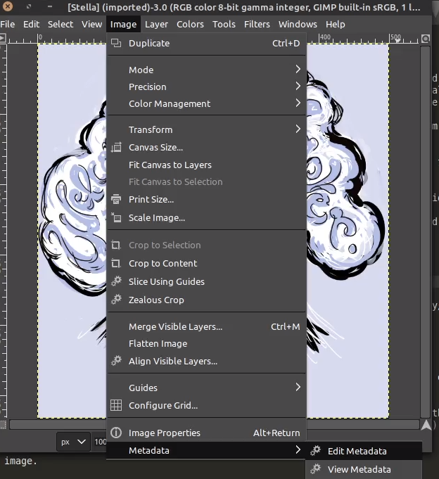
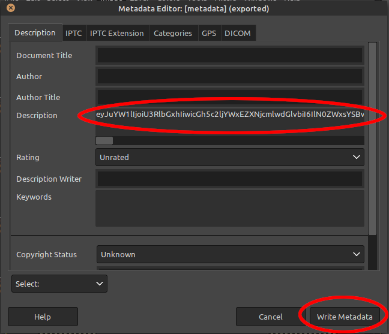
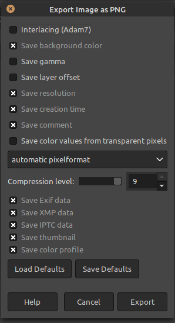

# Introduction
These scripts provide a framework for generating `base64` encoded characters for AID. They can be run as a part of a scenario or from the command-line.

## Motivation
Character generation and persisting NPCs through AID has been a difficult problem to solve given the available tools. World Info entries only get triggered when one of the keys are mentioned in the context and copy/pasting into a Scenario prompt or memory can become tedious. I wanted to create a streamlined process for creating and loading characters that would allow them to behave consistently (as consistently as AID will allow, that is) and be portable. The scripts contained allow you to generate a reusable and sharable code for an NPC which can be used in prompts like [Infinity Brothel](https://github.com/CoomersGuide/CoomersGuide.github.io/tree/main/User-Content/Sink-chan/Infinity-Brothel/Infinity-Brothel).
Because I didn't want to force users to spend AID energy to essentially base64 encode a JSON string, I also provide a mechanism to run this generation from a user's command line.

## Setup
In order to run the Character Generator locally, you will need to have working and updated installations of `nodejs` and `npm`. If you do not already have these installed and running, the associated websites have good instructions on how to install, configure, and run these tools.

These scripts were written with `nodejs (version >= v14.15.5)` and `npm (version >= 6.14.11)`, so it is recommended that your tools be at least those versions before proceeding.

Once you have the tools installed, navigate to the `Character-Generator` folder in your command line and run: `npm install`. This will install the required dependencies needed to run the tests.

## Running The Generator
To run the generator, you simply need to run:
```
npm run generate
```
This will run the generator with each of the questions needed to create the NPC. Afterwards, the character's code will be printed to the command-line. Copy/paste that code into your running Scenarios to interact with that character.

Enjoy!

## Optional: Adding the Code to an Image
Once you have the code, feel free to play with the character, import them into your scenario, or share the code. If you want to go the extra mile, you can embed the code into an image to share.

### Picking / Editing Your Image
To give your character's presentation a bit of punch, you might want to consider creating a "card" for your character or making an appealing image to get their personality across. A number of templates for creating cards has been made available: [here](templates). If you need software to edit image files, you can use [GIMP](https://www.gimp.org/downloads/). It's free.

### Embedding Your Character Code and Exporting
Once your image is ready, you just need to embed your character code into the image.

---
**Technical Note**

The supported Metadata tags are `ImageDescription` (for JPG) and `description.value` (for PNG). In GIMP these are both filled out by setting the `Description` field.

---

1. In GIMP, open your image and perform your desired edits.
1. Select Image -> Metadata -> Edit Metadata

1. Paste the character code in the Description field and click "Write Metadata"

1. Export the image and make sure the Metadata export boxes (EXIF, etc.) are selected.

1. Your character card has been saved with your character code. It's ready to share!

### Testing Your Card Before You Share
You might also want to test extracting your character code from the image with the [Character Extractor](https://github.com/CoomersGuide/CoomersGuide.github.io/tree/main/Tools/Character%20Extractor) before you share!
