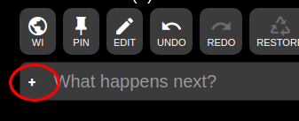
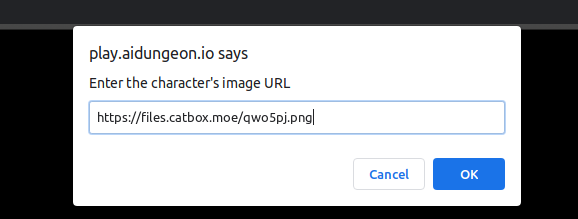
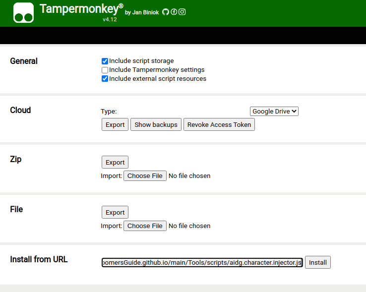

# Introduction
This is a user script for loading `base64` encoded characters from images hosted online directly into AI Dungeon.

## Functionality
When installed and enabled, it will add a (+) button to your adventure's action bar.

Clicking this button will prompt you for an image URL. Entering the URL will cause the script to fetch the image and attempt to extract a valid AID character.

If a valid AID character is found, its load command will be sent to the server. This is a convenience; equivalent to extracting the code and typing `/load <character code>` yourself then pressing enter.

## Accepted Domains
The script is limited to two domains by default:
- raw.githubusercontent.com
- files.catbox.moe

All other URLs will be rejected

---
**Note**

At some point in the future, we hope to have a booru or similar image source to host our character cards. When this is set up, we will add that domain to the allowed domains of the script.

---

## Setup
To set up the user script, first make sure you are using the most recent version of Chrome or Firefox. Then you will need to install a user script extension. This user script works with the most recent versions of `Tampermonkey` (>= 4.12) and `Greasemonkey` (>= 4.11). The script does not appear to work on the current version of `Violentmonkey`

Once you have installed the prerequisites, install the user script from this repo. For instance, Tampermonkey and Greasemonkey have utilities from installing userscripts from a URL or a file (if you download the user script).

Once you reload AI Dungeon, you should see the new (+) button in your adventures.
